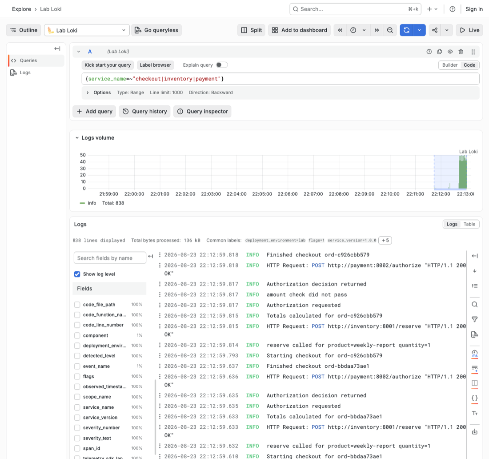
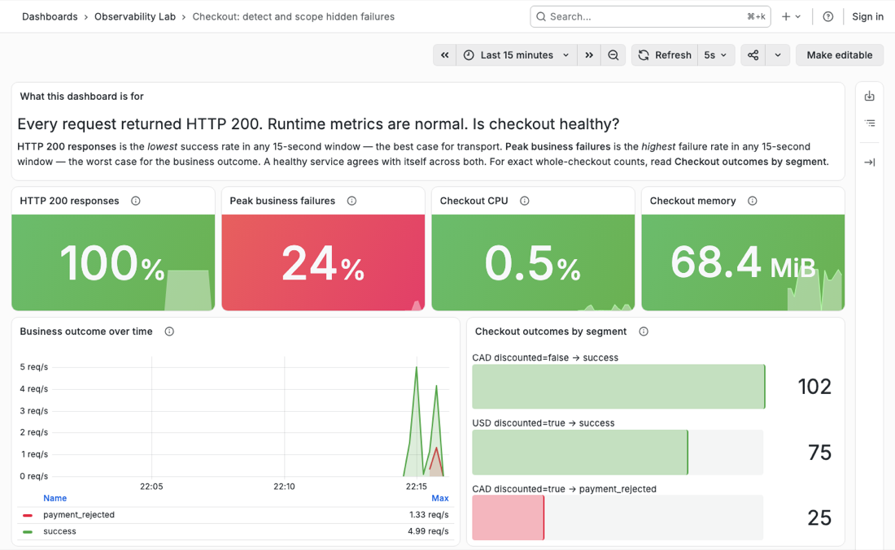
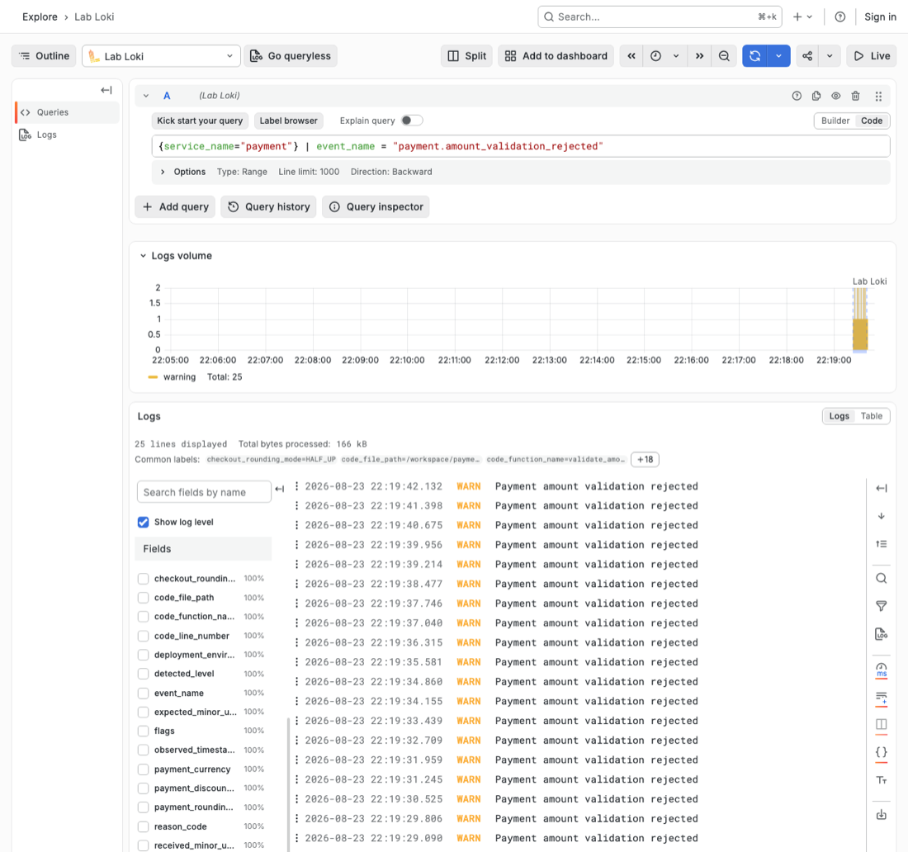

# Checkout is quietly failing

> **This is the source text of the lab guide.** The version to work from is `guide.html` — run
> `./lab guide` — which adds one-click Grafana views, copy buttons and diagrams. If you would rather
> stay here, read it in a Markdown preview (`Cmd+Shift+V` in VS Code): both versions hide answers and
> screenshots behind toggles, and a plain text editor shows them all immediately.

**09:12.** You are on call for checkout. A payments teammate messages you: *"a few customers are
saying checkout does nothing."*

No alert fired. Every dashboard you have is green. Every request in the last hour returned
HTTP 200. Nobody can tell you how many customers, or which ones, or what "does nothing" means.

You are going to work this incident to a root cause. You cannot get there with the telemetry this
service ships with today, so three times along the way you will stop, add one small piece of
instrumentation to the running system, and use it to answer the question in front of you. Every
code block and every Grafana view is supplied — you never configure the telemetry stack or write a
query.

## Before you start

The stack must already be built. If you have not done it yet, run `./lab setup` once while
online (see [README.md](../README.md)). It only has to happen once.

## The system you are on call for

<!-- figure: system-map replaces-next -->

```text
Traffic generator
       |
       v
Checkout API ------> Inventory service
       |
       +-----------> Payment service
```

This is the same checkout world as the presentation, with a different incident. The services are
already running locally in Docker. **Every request returns HTTP 200, even when the checkout
business outcome is rejected.**

## What you will be asked

Four questions decide how this hour goes. Right now you can answer none of them, and you will keep
coming back to this table as the incident develops.

| Question | Can you answer it? |
| --- | --- |
| **Detect** — is checkout behaving correctly? | ❌ not yet |
| **Scope** — which requests are affected? | ❌ not yet |
| **Isolate** — where did one operation fail? | ❌ not yet |
| **Explain** — what application condition caused it? | ❌ not yet |

---

## 0. Get your tools up

Before the first question lands, make sure the environment is running.

```bash
./lab start
./lab ready
```

`./lab start` can take two to three minutes the first time. Expected readiness message:

```text
READY: checkout, inventory, payment, metrics, traces, logs, and Grafana are available
PASS Grafana: dashboard, datasources, Explore access, and bidirectional correlation are provisioned
```

If `./lab ready` reports that a backend is not serving data yet, **run it again** — the telemetry
backends sometimes need a second attempt on a cold start. If it still fails, run
`./lab restart-services` and then `./lab ready`.

Every Grafana view this lab uses is a button in the guide, and `./lab links` prints the same four
URLs if you would rather keep them in a terminal. All views use a relative 15-minute time range.
Grafana needs no login — the lab runs it with anonymous access, so ignore the "Sign in" button in
the corner.

### Where you will be making changes

When the moment comes, it is two files under `services/`, three markers, nothing else:

| Section | File | Marker |
| --- | --- | --- |
| 2. Metrics | `services/checkout/app/checkout.py` | `# LAB 1: record checkout result` |
| 3. Traces | `services/payment/app/validation.py` | `# LAB 2: replace validation evidence block` |
| 4. Structured logs | `services/payment/app/validation.py` | `# LAB 3: record amount validation rejection` |

Open the repository in your editor now. Both services run with hot reload, so saving the file is
the entire deploy step — you never rebuild or restart a container during this lab.

### If an edit goes wrong

A paste at the wrong indentation stops the service reloading, and the next traffic run fails
instead of producing evidence. Two escapes:

```bash
./lab logs checkout          # or payment; shows the syntax error
./lab checkpoint metrics     # restore correct code for a stage: metrics|traces|logs
```

`./lab checkpoint <stage>` restores code only, so it is also how you catch up if you fall behind.
`./lab recover <stage>` does the same and then regenerates and re-verifies the evidence. Both are
cumulative: `traces` includes the metrics change, and restoring an earlier stage discards later
edits.

---

## 1. Three minutes with what you have

**09:15.** You start where anyone starts: the logs. That is all this service has — prose logs, the
thing most services ship with and nothing else.

Reproduce what the customers hit:

```bash
./lab traffic incident
```

That is 100 checkouts. Open **Noisy starting logs**. You should be looking at
something like this:



Two details in that screenshot are the whole problem. The volume histogram is a single flat band of
`info` — 838 lines, one severity. And the Fields sidebar on the left offers `service_name`,
`severity_text`, and the file and line each message came from, but not one field describing what a
checkout actually *did*.

### Your three minutes

Set a timer for three minutes. Using **only** those logs, answer as much as you can:

| # | Question | Your answer | Confidence |
| --- | --- | --- | --- |
| 1 | How many payment validations were rejected? | | |
| 2 | Which currency and discount segment was affected? | | |
| 3 | Which checkout request produced one specific rejection? | | |

**Stop at three minutes even if you are mid-scroll.** Do not skip this. This is your honest
baseline — what the service can tell you today, under exactly the pressure a real incident applies
— and the rest of the hour only means something if you have felt it.

### Why this is worse than it looks

Count the log lines Grafana reports for those 100 checkouts. You will see roughly **840**, every
one of them at `INFO`, so even the level histogram tells you nothing.

- Nothing in any line names the outcome. Checkout logs `Finished checkout ord-4b2c1f8e0a` whether
  the checkout succeeded or was rejected.
- Nothing in any line names the currency or the discount. `Authorization requested` is all Payment
  says on the way in.
- The rejection itself is logged at `INFO`, in three different phrasings that drifted apart as the
  code was maintained: `amount check did not pass`, `Declining authorization: totals differ`, and
  `validate_amount -> False`. A text search for any one of them finds a third of the truth.
- Order IDs are opaque, so you cannot infer a segment from a name.

This is not a contrived handicap. It is what logging looks like when each line was written to help
one developer debug one function, and nobody ever asked whether the service could explain itself.

Now scale it. 840 lines per 100 checkouts is **8.4 lines per checkout**. A service doing 1,000
checkouts per minute emits **about 12 million lines a day**. The three minutes you just spent do
not get shorter; the haystack gets bigger.

**Prediction:** Host metrics look normal and every request is HTTP 200. Is checkout necessarily
healthy?

<details>
<summary>Check the idea</summary>

No. HTTP status shows that the API handled the request. It does not establish that the checkout
business process fulfilled its responsibility.

</details>

**Prediction:** Suppose you could add one thing to these logs and nothing else. What single field
would have rescued your three minutes?

<details>
<summary>Predict first, then open</summary>

The checkout outcome, as a field rather than as prose. With `outcome` attached to a line per
checkout, question 1 becomes a count and question 2 becomes a group-by — but only if the currency
and discount travel with it.

Hold on to that instinct, because it is exactly the right one and it is still not enough. A field
on a log line answers "how many" only after you have queried and counted every matching line. In
section 2 you will attach the same three facts to a **counter** instead, and the backend does the
counting continuously, for a fixed storage cost, whether the service does 100 checkouts an hour or
100,000. The signal you choose is as much a design decision as the field you add.

</details>

### Where the investigation stands

| Question | Can you answer it? |
| --- | --- |
| **Detect** | ❌ Logs show activity, not correctness |
| **Scope** | ❌ No business fields to group by |
| **Isolate** | ❌ No link between a checkout and a payment decision |
| **Explain** | ❌ Prose records that something failed, not why |

---

## 2. How bad is it, and who is affected?

**09:31.** Someone opens an incident bridge and asks the two questions every incident opens with:
*how bad is it, and who is hit?* "I can't tell yet" is an honest answer and a useless one — and it
is the answer you will still be giving in an hour unless something changes right now.

So you stop investigating for two minutes and make the service capable of answering:
**is checkout succeeding, and which bounded segment is failing?**

> **Your move:** one paste into `services/checkout/app/checkout.py`, save, then two traffic runs.

### What the code already gives you

Open `services/checkout/app/checkout.py`. A **counter** — a number the service only ever adds to, which
the backend keeps a running total of — is already declared at the top. It exports nothing, because
no code ever records into it:

```python
checkout_completed = meter.create_counter(
    "checkout.completed", unit="{checkout}",
    description="Completed checkout attempts by business outcome",
)
```

Further down, `process_checkout` works out an `outcome` on every path — `inventory_rejected`,
`payment_rejected` or `success` — then throws it away into prose:

```python
    # The prose log records that checkout ran, not what it decided.
    logger.info("Finished checkout %s", request.order_id)
```

The service knows the answer. It just never says it in a form anything can count.

### Make it say the outcome out loud

Find `# LAB 1: record checkout result` in `services/checkout/app/checkout.py` and paste this immediately
below it. It starts with four spaces because it sits inside `process_checkout`:

```python
    checkout_completed.add(
        1,
        {
            "checkout.outcome": outcome,
            "checkout.currency": request.currency,
            "checkout.discounted": request.discounted,
        },
    )
```

Save. Uvicorn reloads in about a second — no rebuild, no restart.

<details>
<summary>Verify your edit — what the region should look like now</summary>

```python
    # The prose log records that checkout ran, not what it decided.
    logger.info("Finished checkout %s", request.order_id)

    # LAB 1: record checkout result
    checkout_completed.add(
        1,
        {
            "checkout.outcome": outcome,
            "checkout.currency": request.currency,
            "checkout.discounted": request.discounted,
        },
    )

    return {"order_id": request.order_id, "outcome": outcome}
```

Indentation is the usual failure. Everything above is inside `process_checkout`, at four spaces.

</details>

### Start the traffic, then keep reading

Nothing shows up in Grafana until checkouts actually run, so start them now. Open **Runtime and
checkout metrics** and leave it in another tab — it refreshes itself every five seconds — then run
both profiles:

```bash
./lab traffic healthy
./lab traffic incident
```

Each run takes about 45 seconds. Within a few seconds of the first one, panels that were empty all
morning start drawing: your one `.add()` call is the only reason there is anything to draw.

**Read the next two parts while the runs finish**, then come back to the dashboard.

<details>
<summary>Nothing appears at all after a minute</summary>

The paste probably stopped the service reloading. Look for the syntax error, and restore
known-good code if you need it:

```bash
./lab logs checkout
./lab checkpoint metrics
```

See [If an edit goes wrong](#if-an-edit-goes-wrong) in section 0.

</details>

### What that block does

- **`.add(1, ...)`** adds one to the counter. Counters only go up; you never work out a rate or a
  percentage in application code, because the backend derives those from the running total.
- **Where it sits** — after every branch has settled on `outcome`, before the `return` — records
  exactly one increment per checkout, whatever happened. Inside the success branch only, it would
  silently miss the failures you are hunting.
- **`checkout.outcome`** is your *Detect* answer: not "the API responded" but "the business
  process succeeded or did not."
- **`checkout.currency` and `checkout.discounted`** are your *Scope* answer: **which** checkouts
  are failing, without opening a log line.

Dotted lowercase names are OpenTelemetry convention, so yours read like the attributes
auto-instrumentation already emits.

### The one thing to get right: keep the attributes countable

A counter does not store your checkouts. It stores **one running total per unique combination of
attribute values**. Each of those totals is called a *time series* — one line that only ever ticks
upward.

<!-- figure: cardinality-explosion -->

Your three attributes can only combine so many ways, so after a 100-checkout incident run the
entire metric is three lines:

| What the backend keeps | Running total |
| --- | --- |
| `outcome=success, currency=CAD, discounted=false` | 50 |
| `outcome=success, currency=USD, discounted=true` | 25 |
| `outcome=payment_rejected, currency=CAD, discounted=true` | 25 |

Run a million checkouts tomorrow and it is still those lines, with bigger numbers on them. The
ceiling comes from the vocabulary, not the traffic: 3 outcomes × 2 currencies × 2 discount states
is **12 lines at most, forever**. Time series are the unit a metrics backend stores, searches and
bills you for, so that ceiling is the whole design. The number of series your attributes can
produce is called their *cardinality*, and keeping it small and knowable is the job.

**Prediction:** `order_id` is right there in the request, and a metric that could name the failing
orders sounds far more useful. Why is it not in the attribute dictionary?

<details>
<summary>Predict first, then open</summary>

Because order IDs never repeat, so every single checkout invents a line of its own:

| What the backend keeps | Running total |
| --- | --- |
| `outcome=payment_rejected, currency=CAD, discounted=true, order_id=ord-e6d778add6` | 1 |
| `outcome=payment_rejected, currency=CAD, discounted=true, order_id=ord-5c21f308dc` | 1 |
| …98 more, one per checkout | 1 |

100 checkouts, 100 lines, each stuck at 1 and each kept forever. At 1,000 checkouts a minute that
is **1.4 million new lines a day**, sitting in the backend's memory and index. You have not built a
metric; you have built an expensive log that cannot be graphed.

Nothing errors when you do this. It works on your laptop, it passes review, and it arrives weeks
later as backend cost, slow queries or an out-of-memory metrics server that nobody traces back to
one line of application code. It is the most common way teams break a metrics pipeline.

**The test:** could you write down every possible value in advance? Outcomes, currencies,
true/false — yes. Order IDs, request IDs, customer IDs, trace IDs, product IDs, raw URLs — no.
Those never go in a metric attribute.

The detail is not lost, it just belongs elsewhere. Traces and structured events store one record
per request instead of one total per combination, which is exactly what you build in sections 3
and 4. Each signal gets the cardinality it can afford.

</details>

### Read the dashboard

Both runs should be finished. **Business outcome over time** draws the healthy run as one green
line and the incident run as a second red one underneath it, and four stat tiles sit across the
top. Two of those tiles disagree with each other, which is exactly the disagreement you came here
to find:

- **HTTP 200 responses: 100%.** Transport never noticed.
- **Checkout CPU and memory:** normal.
- **Peak business failures: 24–27%.** This panel reports the worst 15-second window, so it lands
  near but not exactly on the true rate depending on where the window falls.
- **Checkout outcomes by segment:** one failing row — `CAD discounted=true → payment_rejected`,
  at 25 — beside two clean ones.

<details>
<summary>Why the segment numbers land where they do</summary>

The panel counts whole checkouts across both runs. The healthy run sends 50 standard CAD and 50
discounted USD; the incident run sends 50 standard CAD, 25 discounted USD and 25 discounted CAD.
So roughly 100 standard CAD and 75 discounted USD succeed, and the 25 discounted CAD checkouts —
a segment that only appears in the incident run — are the entire failure.

</details>

<details>
<summary>Show the finished dashboard — it contains the answer to your section 1 table</summary>



Transport is perfect and the business is not, on the same screen, for the same requests. The
segment panel underneath names the affected group outright.

</details>

The dashboard is the primary verification. For the exact numbers, run:

```bash
./lab check metrics
```

If the check reports a code/service error or times out:

```bash
./lab recover metrics
```

Recovery restores the checkpoint, waits for the reload, generates fresh traffic and re-verifies —
see [If an edit goes wrong](#if-an-edit-goes-wrong) in section 0. Always recover the stage you are
on; an earlier stage discards later edits.

### Back to your three minutes

Go back to your table in section 1. The true answers are **25 rejections**, all in **discounted
CAD**. How close were you — and how does three minutes of scrolling compare with the ten seconds
it just took to read the segment panel?

### What you can now tell the bridge

1. **Detect:** Checkout is unhealthy because ____________________________________.
2. **Scope:** The affected segment is __________________________________________.
3. The metric does not yet prove ______________________________________________.

<details>
<summary>Check your evidence</summary>

1. About a quarter of checkouts return a failed business outcome, even though every HTTP response
   is 200.
2. Rejections are concentrated in discounted CAD checkouts. Standard CAD and discounted USD ran in
   the same window and every one of them succeeded.
3. The metric does not show which operation rejected one request or why its amount was rejected.

</details>

**Prediction before you move on:** the dashboard says 25 discounted CAD checkouts were rejected.
Could you use this metric to pull up one of those 25 rejected checkouts?

<details>
<summary>Predict first, then open</summary>

No, and this is the boundary of what metrics are for. A counter is an aggregate: it tells you that
25 checkouts in this segment failed, and nothing whatsoever about which 25. There is no request
inside a counter to open.

That limit is structural, not a gap in this particular metric — it is the reason the next signal
exists. Traces keep per-request detail, so you can follow one checkout through Inventory and
Payment and see where it turned.

</details>

### Where the investigation stands

| Question | Can you answer it? |
| --- | --- |
| **Detect** | ✅ ~25% of checkouts fail their business outcome |
| **Scope** | ✅ Discounted CAD only; other segments are clean |
| **Isolate** | ❌ The metric counts outcomes, it does not follow a request |
| **Explain** | ❌ No amounts, no reason |

**Before you move on:** do not continue until the dashboard or `./lab check metrics` confirms
the new evidence.

---

## 3. Where did it break?

**09:48.** You post the segment breakdown. The bridge now knows a quarter of discounted CAD
checkouts are being rejected, and the next message is the obvious one: *whose service?*

Checkout calls Inventory and Payment. Both are green, both returned 200, and the counter you just
added cannot break the tie — there is no request inside a counter to open. Inventory's on-call has
joined the bridge and wants to know whether they can stand down.

**Which operation rejected an affected checkout?**

> **Your move:** replace one block in `services/payment/app/validation.py`, save, then one traffic run.

### What the SDK already gives you

A **trace** is one request's story across every service it touched. A **span** is one step in that
story: a timed operation with a name, some attributes, and a status of OK or error. Spans nest
inside each other, which is why a trace reads as a waterfall.

<!-- figure: trace-waterfall -->

Automatic instrumentation is already recording spans for the HTTP calls between Checkout,
Inventory and Payment, so a trace of the whole request exists right now. What it cannot know is
which *business decision* inside Payment mattered — it sees an HTTP handler, not an amount
validation. Naming that decision is your job, and it takes one `with` block.

Open `services/payment/app/validation.py`. The imports you need are already at the top:

```python
from opentelemetry.trace import Status, StatusCode
from shared.telemetry import tracer
```

### Name the decision

Find this marker and the weak log/return block immediately below it:

```python
# LAB 2: replace validation evidence block
```

Replace the marker and everything from it through `return accepted` with the block below. Its
first line begins with four spaces because it remains inside `validate_amount`:

```python
    # LAB 2: replace validation evidence block
    with tracer.start_as_current_span("payment.amount_validation") as span:
        span.set_attribute("payment.currency", currency)
        span.set_attribute("payment.discounted", discounted)
        span.set_attribute("validation.result", "accepted" if accepted else "rejected")
        if not accepted:
            span.set_status(Status(StatusCode.ERROR, "amount validation rejected"))

        # LAB 3: record amount validation rejection
        if not accepted:
            _log_weak_rejection()

        return accepted
```

Save the file. `_log_weak_rejection` is the old prose helper; it stays for one more section so you
can compare it directly with what replaces it.

<details>
<summary>Verify your edit — what the function should look like now</summary>

```python
def validate_amount(
    unrounded_total: str,
    received_minor_units: int,
    currency: str,
    discounted: bool,
) -> bool:
    expected_minor_units = payment_expected_amount(unrounded_total)
    accepted = received_minor_units == expected_minor_units

    # LAB 2: replace validation evidence block
    with tracer.start_as_current_span("payment.amount_validation") as span:
        ...
        return accepted
```

The old two-line `if not accepted: _log_weak_rejection()` / `return accepted` block should no
longer exist at four-space indentation — it now lives inside the `with` block.

</details>

### Start the traffic, then keep reading

Spans only exist for requests that actually happen, so send another hundred:

```bash
./lab traffic incident
./lab check traces
```

That takes about a minute, and the check prints a fresh trace ID when it finishes. **Read the next
two parts while it runs.**

<details>
<summary>The check fails, or prints no trace ID</summary>

Payment probably did not reload — a `with` block at the wrong indentation is the usual cause:

```bash
./lab logs payment
./lab recover traces
```

</details>

### What that block does

- **`start_as_current_span("payment.amount_validation")`** opens a span and makes it the active one
  until the block exits. You never pass it a parent — the HTTP auto-instrumentation already opened
  a server span for `POST /authorize`, and the SDK nests yours underneath it.
- **The name is the decision, not the function.** `payment.amount_validation` is what you want to
  spot in a waterfall; `validate_amount` is an implementation detail that gets renamed one day.
- **`set_attribute(...)`** makes the span filterable. `payment.currency` and `payment.discounted`
  are the same two dimensions you used in the metric, so the segment you scoped in section 2 is
  the segment you can search for here.
- **`set_status(Status(StatusCode.ERROR, ...))`** is the load-bearing line: it marks the span
  failed, draws the red icon, and makes `status = error` a valid search. Without it a rejection is
  a perfectly ordinary-looking span — the same trap as HTTP 200.
- **The `with` block closes the span for you**, which is what gives the operation a duration.
  `return accepted` moves inside on purpose, and so does the event you add in section 4.

<details>
<summary>How three separate services end up in one trace</summary>

<!-- figure: trace-propagation -->

Checkout's outgoing HTTP request carries the trace context in its headers, and each service's
auto-instrumentation reads it back out, so Checkout, Inventory and Payment land in **one** trace
with no plumbing from you. Anything you open inside that request — this span included — joins the
same trace automatically.

It is also why the next section's log line goes *inside* this `with` block. Code running in the
block has this span as its active context, so its record will correlate to this validation rather
than to the HTTP request wrapped around it.

</details>

### What you deliberately left out of the span

There are no amounts here. No `expected_minor_units`, no rounding modes. That is deliberate, and
`./lab check traces` actively fails if amounts leak into the span.

**Prediction:** why hold the amounts back when you already have them in scope on this line?

<details>
<summary>Predict first, then open</summary>

Two reasons, one pedagogical and one real.

The real one is separation of duty between signals. A trace answers **where** — which operation,
in which service, in what order, taking how long. An event answers **why** — the specific values
and the condition. Spans are emitted for every request whether it succeeds or not, so every
attribute you attach is paid for on all of them; a rejection payload belongs on the rejection, not
on all 100 spans. Keeping the boundary sharp also keeps the trace readable at a glance.

The pedagogical one: if the span carried the amounts, section 4 would have nothing left to teach
you, and you would never feel the difference between "I can name the failing operation" and "I can
explain the failure."

</details>

**Prediction:** the trace you are about to open contains the HTTP 200 that Checkout returned for
this request. Will the root span be green or red?

<details>
<summary>Predict first, then open — the screenshot below gives it away</summary>

Green. The root span is the HTTP request, and the HTTP request genuinely succeeded — Checkout
handled it, returned 200, and nothing threw.

The red is on the child span, because that is where your code made a judgement and recorded it.
This is the same "every request returns 200" problem you started with, except the waterfall now
shows both truths at once: transport succeeded, the business decision did not. A green root with a
red child is a completely normal, correct picture of a business failure.

</details>

### Read the trace

Open **Failed payment-validation traces** and **click any Trace ID** from the run you just made. You are looking at one request's whole life: roughly fifteen spans, three
services nested inside each other in the order the request travelled.

Look for:

- One distributed trace containing Checkout, Inventory, and Payment work.
- A successful top-level HTTP request, because Checkout returned 200.
- A `payment.amount_validation` child span marked with a red `ERROR` icon.
- **Click that span** to expand it and read its attributes: `payment.currency=CAD`,
  `payment.discounted=true`, `validation.result=rejected`.

<details>
<summary>Show the finished waterfall — it names the failing service for you</summary>


The same picture also rules a service out: `inventory POST /reserve` finished in 721µs with no
error, so Inventory is cleared by the very view that indicts Payment.

</details>

If the evidence does not appear:

```bash
./lab recover traces
```

### Back to question 3

"Which checkout request produced one specific rejection?" — the trace ID at the top of that
waterfall is the answer, and section 1 had nothing that could produce it. Payment's prose and
Checkout's prose were unrelated text in one shared stream. One propagated trace context later, a
single request carries one identifier across all three services, and you can hand that ID to
somebody else knowing they will look at exactly the request you looked at.

### What you can now hand to Payments

1. Inventory ________________________________________________.
2. The request was rejected during ___________________________.
3. The trace still does not explain __________________________.

<details>
<summary>Check your evidence</summary>

1. Inventory completed successfully for the selected request, in well under a millisecond.
2. The request was rejected during Payment amount validation.
3. The trace does not explain the expected value, received value, or why those values differed.

</details>

### Where the investigation stands

| Question | Can you answer it? |
| --- | --- |
| **Detect** | ✅ ~25% of checkouts fail their business outcome |
| **Scope** | ✅ Discounted CAD only |
| **Isolate** | ✅ Payment amount validation, with Inventory ruled out |
| **Explain** | ❌ You can name the operation, not the condition |

**Before you move on:** you should be able to name the failing operation without yet naming the
cause.

---

## 4. Why did it break?

**10:03.** You can name the operation, so you page the Payments on-call. This is the moment most
incidents go sideways: the entire content of your page is "amount validation rejects discounted
CAD." The first reply comes back in under a minute — *what were the amounts?* — and the only
answer anywhere in the system is `validate_amount -> False`.

Two teams are now awake, and neither of you can say what the service actually compared.

**What application condition caused Payment to reject the amount?**

> **Your move:** replace one more block in `services/payment/app/validation.py`, save, then one traffic run.

### What is already there, and why it is useless

The rejection is already being logged — by `_log_weak_rejection`, the helper you have been living
with since section 1:

```python
_WEAK_MESSAGES = (
    "amount check did not pass",
    "Declining authorization: totals differ",
    "validate_amount -> False",
)
```

Three phrasings, at `INFO`, with no fields. This is what "we already log that" usually means.

You are not adding logging here; you are replacing prose with a **structured event** — a log line
whose facts live in named fields instead of inside an English sentence, so they can be filtered,
grouped and counted without anyone parsing text.

<!-- figure: prose-vs-event -->

### Say what the service compared

In `services/payment/app/validation.py`, find:

```python
# LAB 3: record amount validation rejection
```

Replace the `if not accepted` block immediately below that marker with the block below. Its first
line begins with eight spaces because it remains inside the span:

```python
        if not accepted:
            logger.warning(
                "Payment amount validation rejected",
                extra={
                    "event_name": "payment.amount_validation_rejected",
                    "reason_code": "minor_unit_mismatch",
                    "payment_currency": currency,
                    "payment_discounted": discounted,
                    "expected_minor_units": expected_minor_units,
                    "received_minor_units": received_minor_units,
                    "checkout_rounding_mode": "HALF_UP",
                    "payment_rounding_mode": "HALF_EVEN",
                },
            )
```

Save the file. The call to `_log_weak_rejection()` is gone; the helper above is now dead code, which
is exactly what should happen to it.

<details>
<summary>Verify your edit — what the span block should look like now</summary>

```python
    # LAB 2: replace validation evidence block
    with tracer.start_as_current_span("payment.amount_validation") as span:
        span.set_attribute("payment.currency", currency)
        span.set_attribute("payment.discounted", discounted)
        span.set_attribute("validation.result", "accepted" if accepted else "rejected")
        if not accepted:
            span.set_status(Status(StatusCode.ERROR, "amount validation rejected"))

        # LAB 3: record amount validation rejection
        if not accepted:
            logger.warning(
                "Payment amount validation rejected",
                extra={
                    "event_name": "payment.amount_validation_rejected",
                    "reason_code": "minor_unit_mismatch",
                    "payment_currency": currency,
                    "payment_discounted": discounted,
                    "expected_minor_units": expected_minor_units,
                    "received_minor_units": received_minor_units,
                    "checkout_rounding_mode": "HALF_UP",
                    "payment_rounding_mode": "HALF_EVEN",
                },
            )

        return accepted
```

The two `if not accepted:` blocks are both at eight spaces, inside the `with`. `return accepted`
is still the last line of the block.

</details>

### Start the traffic, then keep reading

One more hundred checkouts, so there are rejections to look at:

```bash
./lab traffic incident
./lab check logs
```

About a minute. **Read the next two parts while it runs.**

<details>
<summary>The check fails</summary>

```bash
./lab logs payment
./lab recover logs
```

</details>

### What that block does

- **`extra={...}`** turns each key into a real field on the record. The OpenTelemetry handler in
  `services/shared/telemetry.py` forwards them and Loki stores them as structured metadata — fields you
  filter and group by, not text you parse out of a message.
- **`event_name`** is a stable identifier for *this decision*, independent of wording. You watched
  three phrasings of one rejection drift apart in section 1; dashboards and alerts key on this
  instead, so the message text stays free to change.
- **`reason_code`** is a bounded, machine-readable *why*. It is the difference between "rejections
  are up" and "rounding mismatches are up."
- **`expected_minor_units` / `received_minor_units`** are integers in the currency's smallest
  unit — cents here, so `1000` is CAD 10.00. Integers are exact and comparable; `"$10.00"` and
  `"10,01"` are neither.
- **`checkout_rounding_mode` / `payment_rounding_mode`** turn a symptom into a cause: not just
  that the amounts differed, but that the two services rounded differently.
- **`logger.warning`** is a routing decision, not decoration — see the next block.
- **Sitting inside the `with`** means the span from section 3 is still active, so OpenTelemetry
  stamps this record with its trace and span IDs. That is your link from event to trace and back,
  with no correlation ID passed by hand.

**Prediction:** the fields you need for correlation — trace ID and span ID — are nowhere in that
`extra` dictionary. So how does Grafana get from this log line to the trace?

<details>
<summary>Predict first, then open</summary>

The SDK adds them. A log record emitted while a span is active picks up that span's trace and span
IDs from the active context automatically, which is the whole reason this `logger.warning` sits
inside the `with` block rather than after it.

Move the same call below the `with` block and it would not lose the trace outright — the HTTP
server span for `POST /authorize` is still active out there, so the record would attach to *that*
instead. You would keep the trace ID and lose the precision: the event would no longer point at the
validation operation, and **Logs for this span** on the red span would come back empty. Placement
is instrumentation.

</details>

### Choosing the severity, and what never goes in

**Prediction:** the rejection is a failure. Should this be `ERROR`?

<details>
<summary>Predict first, then open</summary>

No — `WARN` is correct. Severity is about **who needs to act**, not about how bad the word sounds.
Payment did its job perfectly: it validated an amount, found a mismatch, and declined. Nothing in
Payment is broken, so paging the Payment on-call at 3am would be wrong.

But it is not routine either — something upstream is behaving abnormally and it is costing
checkouts. That is precisely what `WARN` means: notable, actionable in daylight, not an outage.

`INFO`, which is where this started, is the actual bug. It is why 25 rejections sat invisible among
838 lines at the same level.

</details>

**Prediction:** which fields did we deliberately *not* put in this event?

<details>
<summary>Predict first, then open</summary>

Card numbers, payment tokens, customer details, order IDs, and the raw request payload. None of it
is here.

Structured logging makes accidental exfiltration easy: `extra={**request.dict()}` is one keystroke
away and would ship whatever the request happened to contain, forever, to a log store with a
different access model than your database. Choose fields deliberately, one at a time, and prefer
the narrowest value that answers the question — the two integers above explain this incident
completely without a single piece of customer data.

</details>

### Read the events

Open **Structured payment-validation events**. You should see 25 rows at `WARN`
— not `INFO` — and a Fields sidebar listing every business field at 100%, meaning the field is on
every single event rather than on a lucky subset.

**Expand one row** to see the fields attached to it. OpenTelemetry sends them as Loki structured
metadata, so they are attributes on the row rather than text buried in the message.

Fields should include:

- `event_name=payment.amount_validation_rejected`
- `reason_code=minor_unit_mismatch`
- `expected_minor_units=1000`
- `received_minor_units=1001`
- `checkout_rounding_mode=HALF_UP`
- `payment_rounding_mode=HALF_EVEN`
- Trace and span context supplied by OpenTelemetry

Compare that with what the same rejection looked like earlier: `validate_amount -> False`.
Every field in that sidebar is now something you can filter and group by.

<details>
<summary>Show the finished Explore view</summary>



Hold this next to the section 1 screenshot of the same service. Same log stream, same incident —
one is 838 lines of flat `info` with nothing to filter on, the other is 25 warnings with a sidebar
full of business fields.

</details>

Open one event's **Open trace** link. In the trace, use **Logs for this span** to come back to the
correlated event. If either direction is unavailable, use the fresh trace ID printed by the checks
and continue; report the correlation-link issue separately from the telemetry result.

If the event does not appear:

```bash
./lab recover logs
```

### What you can now put in the incident timeline

1. Payment expected ______ minor units and received ______.
2. Checkout used __________________; Payment used __________________.
3. `WARN` is appropriate because ____________________________________________.

<details>
<summary>Check your evidence</summary>

1. Payment expected 1000 minor units and received 1001.
2. Checkout used `HALF_UP`; Payment used `HALF_EVEN`.
3. Payment handled the validation rejection correctly, but the event signals abnormal upstream
   behaviour that matters operationally. It is not a Payment service crash. Note that the old prose
   line was `INFO`, which is why it never stood out from routine chatter.

Integer minor units avoid ambiguous formatted currency strings and preserve the exact one-cent
difference. Card data, payment tokens, customer details, order IDs, and raw payloads are
intentionally absent.

</details>

### Where the investigation stands

| Question | Can you answer it? |
| --- | --- |
| **Detect** | ✅ ~25% of checkouts fail their business outcome |
| **Scope** | ✅ Discounted CAD only |
| **Isolate** | ✅ Payment amount validation |
| **Explain** | ✅ HALF_UP vs HALF_EVEN, 1001 against an expected 1000 |

**Before you move on:** you can now explain the mismatch using a structured event correlated to
the failed span.

---

## 5. Do it again, cold

**10:20.** The rejections start again.

This time nothing gets added, changed, or deployed — the evidence you need is already in the
service. Freeze the code and reproduce the incident:

```bash
./lab traffic incident
./lab check metrics
./lab check traces
./lab check logs
```

**Start a timer when those commands finish**, and stop it when you have all four answers. Complete
[worksheet.md](worksheet.md) by opening the views in this order — open it in a Markdown preview
too, because its answer section is behind a toggle.

### Detect

Open **Runtime and checkout metrics**. Record what changed, the business-failure
percentage, and the time window.

### Scope

On the same dashboard, use **Checkout outcomes by segment**. Record the affected and unaffected
groups, plus one claim the evidence would not support.

### Isolate

Open **Failed payment-validation traces** and click a Trace ID from the run you just made. Record
the failing operation, the trace ID, what the trace establishes, and what it does not explain.

### Explain

From the red span, follow **Logs for this span** to the correlated event. Record expected and
received minor units, the difference, and both rounding modes.

Only after completing the worksheet, open its answer section.

### Time the second run

Three minutes at 09:15 produced no reliable answer. The same incident, the same 100 requests, just
took you under a minute end to end — and the last code change happened *before* this run started.
That gap is the whole subject of this lab.

### What you would do next, for completeness

Nothing in this lab fixes the bug, deliberately: the exercise is about evidence, not about
`Decimal`. For closure — Checkout rounds with `HALF_UP` and Payment with `HALF_EVEN` (both in
`services/shared/domain.py`). A discounted CAD total lands on exactly 10.005 — so `HALF_UP` rounds the
half-cent away from zero and sends 1001, while `HALF_EVEN` rounds it to the nearest even cent and
expects 1000. The repair is to make rounding an explicit shared contract instead of a private
choice each service makes quietly. That you can state the fix in one sentence, and name the file,
is the entire return on the thirty lines you added.

---

## 6. The retro

**11:00.** Incident closed. Now the part that decides whether the next one goes like this or like
09:15.

### What the three changes were, together

You added about thirty lines across two files. They were not three ways of logging the same thing —
each signal does a job the other two structurally cannot:

| Question | Signal | Why this one | What it cannot do |
| --- | --- | --- | --- |
| **Detect / Scope** | Counter with bounded attributes | Aggregates cheaply and continuously; cost is fixed no matter the traffic | Cannot show you any individual request |
| **Isolate** | Span with an error status | Keeps per-request structure and crosses service boundaries | Does not carry the values behind the decision |
| **Explain** | Structured event, correlated | Carries exact values and a reason code for one occurrence | Too expensive and too detailed to aggregate over |

<!-- figure: signal-shapes -->

**Prediction:** could you have done all of this with structured logs alone?

<details>
<summary>Predict first, then open</summary>

You could get answers, but not affordably, and not reliably.

Detect and Scope by log query means counting matching lines over a window every time you ask — at
1,000 checkouts a minute that is scanning millions of lines to produce a number a counter already
holds, and it gets slower exactly when you need it most, during an incident. Alerting on it is
worse.

Isolate by logs alone means reconstructing causality from timestamps across three services. Without
propagated trace context there is no reliable way to know which Payment rejection belongs to which
Checkout request, and timestamps lie under concurrency.

The right conclusion is not "logs are bad." It is that the question you need answered determines
the signal, and a service that can explain itself carries all three.

</details>

### The gate

The change that mattered was not any of the thirty lines — it was that a service in production
could not answer four ordinary questions about itself, and nobody noticed until customers did.
Before approving a feature, ask whether its telemetry can answer:

- **Detect:** Is there a signal showing the feature is fulfilling its responsibility?
- **Scope:** Could we tell when behaviour changed and how widely?
- **Isolate:** Can one operation be followed across its meaningful boundaries, including where it
  failed?
- **Explain:** Are key decisions recorded as structured, safe, correlated events?

For this checkout system, identify the evidence that now satisfies each question.

The key outcome is not that you used Grafana. It is that you diagnosed the incident without adding
telemetry and redeploying after the investigation began.

### Connection to the presentation

The presentation described a reactive loop where teams add the evidence they wish they had during
an incident. Your 09:15 was that loop's starting position. Everything you did between 09:31 and
10:03 was work that team does *after* the pager goes off, under time pressure, with a deploy for
each attempt. Your 10:20 was what the same incident costs when the evidence is already there.

The Microsoft Teams study cited in the presentation found that many incidents were first detected
by people rather than automated monitoring, and that missing telemetry contributed to delayed
root-cause identification in difficult cases.

## Stand down

To stop containers while preserving their current telemetry and completed code for later review:

```bash
./lab stop
```

To restore the starter state and delete local telemetry:

```bash
./lab reset
```
