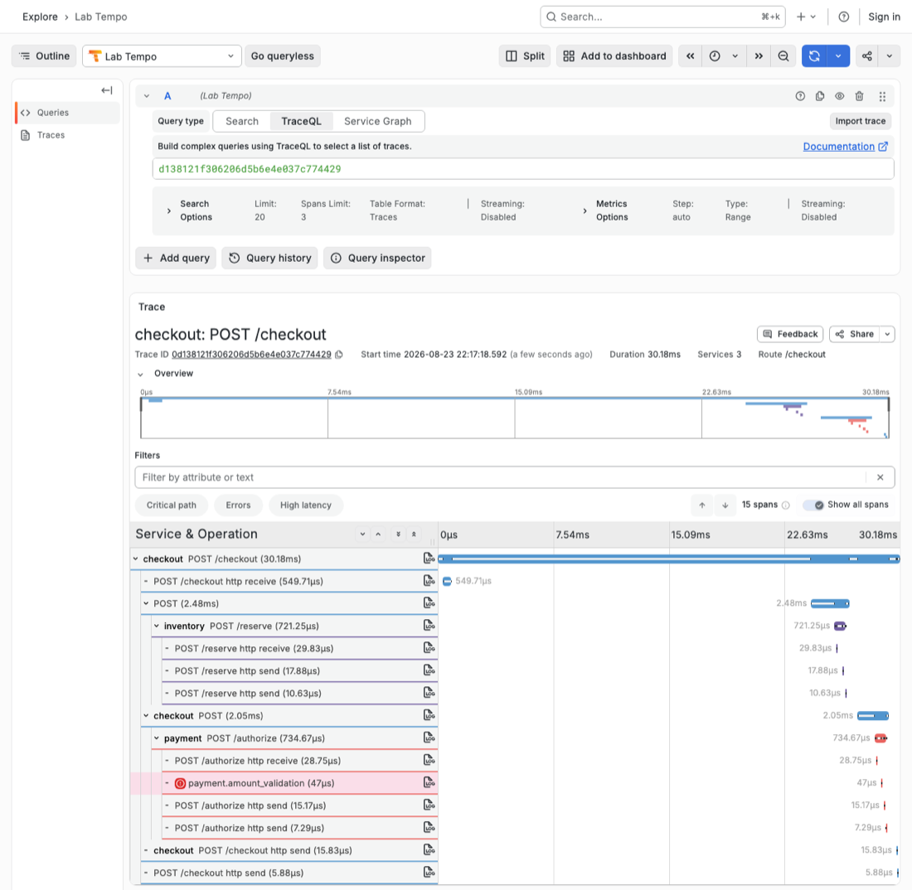

# Guided observability lab

> **Read this file in a Markdown preview.** In VS Code press `Cmd+Shift+V`. This guide hides
> answers behind "Check your evidence" and "Predict first" toggles, and in a plain text editor
> those answers are visible immediately, which removes most of the value of the exercise.

You will make three small, real instrumentation changes to the same checkout system. The guide
supplies every code block and every Grafana view. You do not need to configure the telemetry
stack or write a single query.

Each change is presented the same way, so you always know why you are typing something:

1. **The pain we are fixing** — the question you cannot answer yet.
2. **The change** — the code, plus an anatomy of what every part of it does.
3. **The design decisions** — why it is shaped that way, and what was deliberately left out.
4. **What you should expect to see** — a screenshot of the view this change unlocks.
5. **Produce evidence** — generate it yourself and read it.

## Before you start

The stack must already be built. If you have not done it yet, run `./lab setup` once while
online (see [README.md](README.md)). It only has to happen once.

## What you are investigating

```text
Traffic generator
       |
       v
Checkout API ------> Inventory service
       |
       +-----------> Payment service
```

This is the same checkout world as the presentation, with a different incident. The services are
already running locally in Docker. **Every request returns HTTP 200, even when the checkout
business outcome is rejected.**

## How the lab is scored

You are answering four questions. Right now you can answer none of them. Each section unlocks
exactly one, and you will see this table again at every checkpoint.

| Question | Can you answer it? |
| --- | --- |
| **Detect** — is checkout behaving correctly? | ❌ not yet |
| **Scope** — which requests are affected? | ❌ not yet |
| **Isolate** — where did one operation fail? | ❌ not yet |
| **Explain** — what application condition caused it? | ❌ not yet |

---

## 0. Confirm the environment

```bash
./lab start
./lab ready
./lab links
```

`./lab start` can take two to three minutes the first time. Expected readiness message:

```text
READY: checkout, inventory, payment, metrics, traces, logs, and Grafana are available
PASS Grafana: dashboard, datasources, Explore access, and bidirectional correlation are provisioned
```

If `./lab ready` reports that a backend is not serving data yet, **run it again** — the telemetry
backends sometimes need a second attempt on a cold start. If it still fails, run
`./lab restart-services` and then `./lab ready`.

Keep the printed Grafana links available. All views use a relative 15-minute time range.

---

## 1. The weak starting state

### The situation

You are on call. A payments teammate says "a few customers are complaining that checkout does
nothing." You have what most services ship with: prose logs. Nothing else.

Generate the incident:

```bash
./lab traffic incident
```

That is 100 checkouts. Open **Noisy starting logs** from `./lab links`. You should be looking at
something like this:


### Your task

Set a timer for three minutes. Using **only** those logs, write your answers here:

| # | Question | Your answer | Confidence |
| --- | --- | --- | --- |
| 1 | How many payment validations were rejected? | | |
| 2 | Which currency and discount segment was affected? | | |
| 3 | Which checkout request produced one specific rejection? | | |

**Stop at three minutes even if you are mid-scroll.** Do not skip this section. Feeling the
dead end is the point; the next three sections are only satisfying if you have earned them.

### Why this is worse than it looks

Count the log lines Grafana reports for those 100 checkouts. You will see roughly **840**, every
one of them at `INFO`, so even the level histogram tells you nothing.

- Nothing in any line names the outcome. Checkout logs `Finished checkout ord-4b2c1f8e0a` whether
  the checkout succeeded or was rejected.
- Nothing in any line names the currency or the discount. `Authorization requested` is all Payment
  says on the way in.
- The rejection itself is logged at `INFO`, in three different phrasings that drifted apart as the
  code was maintained: `amount check did not pass`, `Declining authorization: totals differ`, and
  `validate_amount -> False`. A text search for any one of them finds a third of the truth.
- Order IDs are opaque, so you cannot infer a segment from a name.

This is not a contrived handicap. It is what logging looks like when each line was written to help
one developer debug one function, and nobody ever asked whether the service could explain itself.

Now scale it. 840 lines per 100 checkouts is **8.4 lines per checkout**. A service doing 1,000
checkouts per minute emits **about 12 million lines a day**. The three minutes you just spent do
not get shorter; the haystack gets bigger.

**Prediction:** Host metrics look normal and every request is HTTP 200. Is checkout necessarily
healthy?

<details>
<summary>Check the idea</summary>

No. HTTP status shows that the API handled the request. It does not establish that the checkout
business process fulfilled its responsibility.

</details>

**Prediction:** Suppose you could add one thing to these logs and nothing else. What single field
would have rescued your three minutes?

<details>
<summary>Predict first, then open</summary>

The checkout outcome, as a field rather than as prose. With `outcome` attached to a line per
checkout, question 1 becomes a count and question 2 becomes a group-by — but only if the currency
and discount travel with it.

Hold on to that instinct, because it is exactly the right one and it is still not enough. A field
on a log line answers "how many" only after you have queried and counted every matching line. In
section 2 you will attach the same three facts to a **counter** instead, and the backend does the
counting continuously, for a fixed storage cost, whether the service does 100 checkouts an hour or
100,000. The signal you choose is as much a design decision as the field you add.

</details>

### Investigation state

| Question | Can you answer it? |
| --- | --- |
| **Detect** | ❌ Logs show activity, not correctness |
| **Scope** | ❌ No business fields to group by |
| **Isolate** | ❌ No link between a checkout and a payment decision |
| **Explain** | ❌ Prose records that something failed, not why |

---

## 2. Metrics: detect and scope the problem

### The pain we are fixing

You could not say whether checkout is healthy, and you could not say who is affected. Counting by
hand does not scale past a few hundred lines.

### Operational question

How can we see whether checkout is succeeding, and which bounded segment is affected?

### What already exists

Open `checkout/app/checkout.py` and look at the top of the file. The counter is already declared:

```python
checkout_completed = meter.create_counter(
    "checkout.completed", unit="{checkout}",
    description="Completed checkout attempts by business outcome",
)
```

The instrument exists and exports nothing, because no code ever records into it. This is a common
real-world state: someone added the metric definition, and the call site never followed.

Further down, `process_checkout` computes an `outcome` on every path — `inventory_rejected`,
`payment_rejected`, or `success` — and then throws it away into prose:

```python
    # The prose log records that checkout ran, not what it decided.
    logger.info("Finished checkout %s", request.order_id)
```

The service already knows the answer. It just never says it in a form anything can count.

### Add the business-outcome metric

Find this marker in `checkout/app/checkout.py`:

```python
# LAB 1: record checkout result
```

Paste the following code immediately below the marker. The block begins with four spaces because
it sits inside `process_checkout`:

```python
    checkout_completed.add(
        1,
        {
            "checkout.outcome": outcome,
            "checkout.currency": request.currency,
            "checkout.discounted": request.discounted,
        },
    )
```

Save. Uvicorn reloads the service in about a second; do not rebuild or restart it.

<details>
<summary>Verify your edit — what the region should look like now</summary>

```python
    # The prose log records that checkout ran, not what it decided.
    logger.info("Finished checkout %s", request.order_id)

    # LAB 1: record checkout result
    checkout_completed.add(
        1,
        {
            "checkout.outcome": outcome,
            "checkout.currency": request.currency,
            "checkout.discounted": request.discounted,
        },
    )

    return {"order_id": request.order_id, "outcome": outcome}
```

Indentation is the usual failure. Everything above is inside `process_checkout`, at four spaces.

</details>

### Anatomy of the change

- **`.add(1, ...)`** increments a counter by one checkout. Counters only ever go up; they are not
  a running percentage. You never compute a rate in application code — the backend derives rates,
  ratios, and windows from the cumulative total. That is why this is one line and not a stats
  helper.
- **The placement** is after every branch has converged on `outcome` and before the `return`, so
  exactly one increment is recorded per checkout, whatever happened. An increment inside the
  success branch only would silently under-count the failures you are trying to detect.
- **`checkout.outcome`** is the *Detect* dimension. It turns "the API responded" into "the
  business process succeeded or did not."
- **`checkout.currency` and `checkout.discounted`** are the *Scope* dimensions. They are what let
  you say **which** checkouts are failing without opening a single log line.
- **The dotted, lowercase names** follow OpenTelemetry semantic-convention style, so these
  attributes read the same way as the ones the auto-instrumentation emits.

### The design decision that matters: cardinality

Every unique combination of attribute values creates its own time series, and time series are what
you pay for and query against.

| Attributes chosen | Distinct series |
| --- | --- |
| 3 outcomes × 2 currencies × 2 discount states | at most **12**, forever |
| the same, plus `order_id` | **one per order** — unbounded |

**Prediction:** `order_id` is right there in the request and it would make the metric so much more
useful. Why is it not in the attribute dictionary?

<details>
<summary>Predict first, then open</summary>

Because it is unbounded. Adding `order_id` creates a new time series per checkout, and a metrics
backend keeps every series it has ever seen in memory and index. This is the single most common
way teams break a metrics pipeline — and the failure arrives as backend cost and query timeouts
weeks later, not as an error at the call site.

The rule this lab uses: **metric attributes must have a small, bounded, knowable vocabulary.**
Request IDs, order IDs, customer IDs, trace IDs, product IDs and raw URLs all fail that test.

The information is not lost. The per-request identifiers live in traces and structured events,
which are stored per-event rather than per-series — which is exactly what you build in sections 3
and 4. Each signal gets the cardinality it can afford.

</details>

### What you should expect to see

Once you generate traffic in the next step, **Runtime and checkout metrics** should look like
this. Notice the two panels disagreeing on purpose: transport is perfect, the business is not.


### Produce evidence

Open **Runtime and checkout metrics** from `./lab links` and leave it on screen. It auto-refreshes
every five seconds, so you can watch both runs land. Each command takes about 45 seconds.

```bash
./lab traffic healthy
./lab traffic incident
```

Watch **Business outcome over time**: the healthy run draws one green line, and the incident run
draws a second red one underneath it. When both have finished you should see:

- **HTTP 200 responses: 100%.** Transport never noticed.
- **Checkout CPU and memory:** normal.
- **Peak business failures: 24–27%.** This panel reports the worst 15-second window, so it lands
  near but not exactly on the true rate depending on where the window falls.
- **Checkout outcomes by segment:** exact whole checkouts. `CAD discounted=true → payment_rejected`
  is the only failing row.

The dashboard is the primary verification. For the exact numbers, run:

```bash
./lab check metrics
```

If the check reports a code/service error or times out:

```bash
./lab recover metrics
```

Recovery restores the named cumulative checkpoint, waits for reload, generates fresh traffic, and
verifies the evidence. Use the recovery command for your current stage; recovering to an earlier
stage removes later instrumentation edits.

### Score section 1

Go back to your table in section 1. The true answers are **25 rejections**, all in **discounted
CAD**. How close were you, and how long did it take compared with the ten seconds it took to read
the segment panel?

### Record what the metric proves

1. **Detect:** Checkout is unhealthy because ____________________________________.
2. **Scope:** The affected segment is __________________________________________.
3. The metric does not yet prove ______________________________________________.

<details>
<summary>Check your evidence</summary>

1. About a quarter of checkouts return a failed business outcome, even though every HTTP response
   is 200.
2. Rejections are concentrated in discounted CAD checkouts. Standard CAD and discounted USD ran in
   the same window and every one of them succeeded.
3. The metric does not show which operation rejected one request or why its amount was rejected.

`outcome`, `currency`, and `discounted` have small, bounded vocabularies. Request IDs, order IDs,
customer IDs, trace IDs, product IDs, and raw URLs are deliberately excluded from metric attributes
because they would create many unique time series.

</details>

**Prediction before you move on:** the dashboard says 25 discounted CAD checkouts were rejected.
Could you use this metric to pull up one of those 25 rejected checkouts?

<details>
<summary>Predict first, then open</summary>

No, and this is the boundary of what metrics are for. A counter is an aggregate: it tells you that
25 checkouts in this segment failed, and nothing whatsoever about which 25. There is no request
inside a counter to open.

That limit is structural, not a gap in this particular metric — it is the reason the next signal
exists. Traces keep per-request detail, so you can follow one checkout through Inventory and
Payment and see where it turned.

</details>

### Investigation state

| Question | Can you answer it? |
| --- | --- |
| **Detect** | ✅ ~25% of checkouts fail their business outcome |
| **Scope** | ✅ Discounted CAD only; other segments are clean |
| **Isolate** | ❌ The metric counts outcomes, it does not follow a request |
| **Explain** | ❌ No amounts, no reason |

**Checkpoint:** Do not continue until the dashboard or `./lab check metrics` confirms the new
evidence.

---

## 3. Traces: isolate the failing operation

### The pain we are fixing

You know a quarter of discounted CAD checkouts fail. You still cannot point at the operation that
rejected one. Checkout calls Inventory and Payment; either could be at fault, and the metric
cannot tell you which.

### Operational question

Which operation rejected an affected checkout?

### What already exists

Automatic instrumentation already traces the HTTP calls between Checkout, Inventory, and Payment,
so a trace of the whole request is being recorded right now. What it cannot know is which
*business decision* inside Payment mattered — auto-instrumentation sees an HTTP handler, not an
amount validation. Naming that decision is your job, and it is three lines of work.

Open `payment/app/validation.py`. The imports you need are already at the top:

```python
from opentelemetry.trace import Status, StatusCode
from shared.telemetry import tracer
```

### Add the validation span

Find this marker and the weak log/return block immediately below it:

```python
# LAB 2: replace validation evidence block
```

Replace the marker and everything from it through `return accepted` with the block below. Its
first line begins with four spaces because it remains inside `validate_amount`:

```python
    # LAB 2: replace validation evidence block
    with tracer.start_as_current_span("payment.amount_validation") as span:
        span.set_attribute("payment.currency", currency)
        span.set_attribute("payment.discounted", discounted)
        span.set_attribute("validation.result", "accepted" if accepted else "rejected")
        if not accepted:
            span.set_status(Status(StatusCode.ERROR, "amount validation rejected"))

        # LAB 3: record amount validation rejection
        if not accepted:
            _log_weak_rejection()

        return accepted
```

Save the file. `_log_weak_rejection` is the old prose helper; it stays for one more section so you
can compare it directly with what replaces it.

<details>
<summary>Verify your edit — what the function should look like now</summary>

```python
def validate_amount(
    unrounded_total: str,
    received_minor_units: int,
    currency: str,
    discounted: bool,
) -> bool:
    expected_minor_units = payment_expected_amount(unrounded_total)
    accepted = received_minor_units == expected_minor_units

    # LAB 2: replace validation evidence block
    with tracer.start_as_current_span("payment.amount_validation") as span:
        ...
        return accepted
```

The old two-line `if not accepted: _log_weak_rejection()` / `return accepted` block should no
longer exist at four-space indentation — it now lives inside the `with` block.

</details>

### Anatomy of the change

- **`tracer.start_as_current_span("payment.amount_validation")`** creates a span and makes it the
  active one for the duration of the block. You never pass a parent: the HTTP auto-instrumentation
  already opened a server span for `POST /authorize`, and the SDK attaches this one underneath it.
  That is also how the trace crosses the network — Checkout's outgoing request carries the trace
  context in headers, so Checkout, Inventory and Payment land in **one** trace with no plumbing
  from you.
- **The span name is the decision, not the function.** `payment.amount_validation` is what you
  want to spot in a waterfall and query for later; `validate_amount` is an implementation detail
  that will be renamed one day.
- **`set_attribute(...)`** records the facts that make this span filterable. `payment.currency` and
  `payment.discounted` are the same two dimensions you used in the metric, so the segment you
  scoped in section 2 is the segment you can search for here.
- **`set_status(Status(StatusCode.ERROR, ...))`** is the load-bearing line. It is what marks the
  span as failed, what draws the red icon, and what makes `status = error` a valid search. Without
  it, a rejection is a perfectly ordinary-looking span — the same trap as HTTP 200.
- **The `with` block ends the span automatically**, which is what gives it a duration. `return
  accepted` sits inside the block deliberately: returning from outside it would close the span
  before the value is produced and would leave the return path untimed.

### The design decision that matters: what is *not* in the span

There are no amounts here. No `expected_minor_units`, no rounding modes. That is deliberate, and
`./lab check traces` actively fails if amounts leak into the span.

**Prediction:** why hold the amounts back when you already have them in scope on this line?

<details>
<summary>Predict first, then open</summary>

Two reasons, one pedagogical and one real.

The real one is separation of duty between signals. A trace answers **where** — which operation,
in which service, in what order, taking how long. An event answers **why** — the specific values
and the condition. Spans are emitted for every request whether it succeeds or not, so every
attribute you attach is paid for on all of them; a rejection payload belongs on the rejection, not
on all 100 spans. Keeping the boundary sharp also keeps the trace readable at a glance.

The pedagogical one: if the span carried the amounts, section 4 would have nothing left to teach
you, and you would never feel the difference between "I can name the failing operation" and "I can
explain the failure."

</details>

### What you should expect to see

A single trace containing all three services, green at the top, with one red span buried in
Payment:



**Prediction before you look at your own:** Checkout returned HTTP 200 for this request. Will the
root span be green or red?

<details>
<summary>Predict first, then open</summary>

Green. The root span is the HTTP request, and the HTTP request genuinely succeeded — Checkout
handled it, returned 200, and nothing threw.

The red is on the child span, because that is where your code made a judgement and recorded it.
This is the same "every request returns 200" problem you started with, except now the waterfall
shows both truths at once: transport succeeded, the business decision did not. A trace with a
green root and a red child is a completely normal, correct picture of a business failure.

</details>

### Produce evidence

```bash
./lab traffic incident
./lab check traces
```

The check prints a fresh trace ID. Open **Failed payment-validation traces** from `./lab links`,
**click any Trace ID** from the latest run, and read the waterfall.

Look for:

- One distributed trace containing Checkout, Inventory, and Payment work.
- A successful top-level HTTP request, because Checkout returned 200.
- A `payment.amount_validation` child span marked with a red `ERROR` icon.
- **Click that span** to expand it, then read its attributes: `payment.currency=CAD`,
  `payment.discounted=true`, and `validation.result=rejected`.

If the evidence does not appear:

```bash
./lab recover traces
```

### Record what the trace proves

1. Inventory ________________________________________________.
2. The request was rejected during ___________________________.
3. The trace still does not explain __________________________.

<details>
<summary>Check your evidence</summary>

1. Inventory completed successfully for the selected request, in well under a millisecond.
2. The request was rejected during Payment amount validation.
3. The trace does not explain the expected value, received value, or why those values differed.

The span deliberately does not contain amounts or rounding modes. Those details belong in the event
added next; otherwise the trace step would reveal the complete answer and the log would add no
value. `./lab check traces` actively fails if amounts leak into the span.

</details>

### Investigation state

| Question | Can you answer it? |
| --- | --- |
| **Detect** | ✅ ~25% of checkouts fail their business outcome |
| **Scope** | ✅ Discounted CAD only |
| **Isolate** | ✅ Payment amount validation, with Inventory ruled out |
| **Explain** | ❌ You can name the operation, not the condition |

**Checkpoint:** You should be able to name the failing operation without yet naming the cause.

---

## 4. Structured logs: explain the rejection

### The pain we are fixing

You know where it broke. If you page the Payments team now, the entire content of your message is
"amount validation rejects discounted CAD." They will ask what the amounts were, and the only
answer available is `validate_amount -> False`.

### Operational question

What application condition caused Payment to reject the amount?

### What already exists

The rejection is already being logged — by `_log_weak_rejection`, the helper you have been living
with since section 1:

```python
_WEAK_MESSAGES = (
    "amount check did not pass",
    "Declining authorization: totals differ",
    "validate_amount -> False",
)
```

Three phrasings, at `INFO`, with no fields. This is what "we already log that" usually means. You
are not adding logging here; you are replacing prose with evidence.

### Replace the weak prose event

In `payment/app/validation.py`, find:

```python
# LAB 3: record amount validation rejection
```

Replace the `if not accepted` block immediately below that marker with the block below. Its first
line begins with eight spaces because it remains inside the span:

```python
        if not accepted:
            logger.warning(
                "Payment amount validation rejected",
                extra={
                    "event_name": "payment.amount_validation_rejected",
                    "reason_code": "minor_unit_mismatch",
                    "payment_currency": currency,
                    "payment_discounted": discounted,
                    "expected_minor_units": expected_minor_units,
                    "received_minor_units": received_minor_units,
                    "checkout_rounding_mode": "HALF_UP",
                    "payment_rounding_mode": "HALF_EVEN",
                },
            )
```

Save the file. The call to `_log_weak_rejection()` is gone; the helper above is now dead code, which
is exactly what should happen to it.

### Anatomy of the change

- **`extra={...}`** is standard Python logging: each key becomes an attribute on the log record.
  The OpenTelemetry logging handler configured in `shared/telemetry.py` forwards those attributes
  onward, and Loki stores them as structured metadata — real fields you can filter and group by,
  not text you have to parse out of a message.
- **`event_name`** is a stable identifier for *this decision*, independent of wording. Human
  messages drift — you watched three phrasings of one rejection drift apart in section 1.
  Dashboards, alerts and queries key on `event_name`, so the message text stays free to change.
- **`reason_code`** is a bounded, machine-readable classification of *why*. Once rejections carry
  reason codes you can count them by cause, which is the difference between "rejections are up" and
  "rounding mismatches are up."
- **`expected_minor_units` / `received_minor_units`** are integers, not formatted currency. `1000`
  and `1001` are exact and comparable; `"$10.00"` and `"10,01"` are neither.
- **`checkout_rounding_mode` / `payment_rounding_mode`** are what turn a symptom into a cause. The
  event does not merely say the amounts differed, it says the two services rounded differently.
- **`logger.warning`** is a routing decision, not decoration — see below.
- **Its position inside the `with` block matters.** Because the span from section 3 is still the
  active one, OpenTelemetry stamps this record with the trace and span IDs automatically. That is
  what gives you a link from event to trace and back, with no correlation ID passed by hand.

**Prediction:** the fields you need for correlation — trace ID and span ID — are nowhere in that
`extra` dictionary. So how does Grafana get from this log line to the trace?

<details>
<summary>Predict first, then open</summary>

The SDK adds them. A log record emitted while a span is active picks up that span's trace and span
IDs from the active context automatically, which is the whole reason this `logger.warning` sits
inside the `with` block rather than after it.

Move the same call outside the block and the fields would still be there, but the correlation would
be gone — you would have an event that explains a failure with no way to reach the request it
explains. Placement is instrumentation.

</details>

### The design decision that matters: severity and safety

**Prediction:** the rejection is a failure. Should this be `ERROR`?

<details>
<summary>Predict first, then open</summary>

No — `WARN` is correct. Severity is about **who needs to act**, not about how bad the word sounds.
Payment did its job perfectly: it validated an amount, found a mismatch, and declined. Nothing in
Payment is broken, so paging the Payment on-call at 3am would be wrong.

But it is not routine either — something upstream is behaving abnormally and it is costing
checkouts. That is precisely what `WARN` means: notable, actionable in daylight, not an outage.

`INFO`, which is where this started, is the actual bug. It is why 25 rejections sat invisible among
838 lines at the same level.

</details>

**Prediction:** which fields did we deliberately *not* put in this event?

<details>
<summary>Predict first, then open</summary>

Card numbers, payment tokens, customer details, order IDs, and the raw request payload. None of it
is here.

Structured logging makes accidental exfiltration easy: `extra={**request.dict()}` is one keystroke
away and would ship whatever the request happened to contain, forever, to a log store with a
different access model than your database. Choose fields deliberately, one at a time, and prefer
the narrowest value that answers the question — the two integers above explain this incident
completely without a single piece of customer data.

</details>

### What you should expect to see

`WARN` rows — not `INFO` — with every business field listed in the Fields sidebar at 100%,
meaning the field is present on every one of the 25 events:


### Produce evidence

```bash
./lab traffic incident
./lab check logs
```

Open **Structured payment-validation events** from `./lab links`. **Expand one log row** to see the
attached fields — OpenTelemetry sends them as Loki structured metadata, so they are attributes on
the row rather than text in the message.

Fields should include:

- `event_name=payment.amount_validation_rejected`
- `reason_code=minor_unit_mismatch`
- `expected_minor_units=1000`
- `received_minor_units=1001`
- `checkout_rounding_mode=HALF_UP`
- `payment_rounding_mode=HALF_EVEN`
- Trace and span context supplied by OpenTelemetry

Compare that with what the same rejection looked like earlier: `validate_amount -> False`.
Every field in that sidebar is now something you can filter and group by.

Open one event's **Open trace** link. In the trace, use **Logs for this span** to come back to the
correlated event. If either direction is unavailable, use the fresh trace ID printed by the checks
and continue; report the correlation-link issue separately from the telemetry result.

If the event does not appear:

```bash
./lab recover logs
```

### Record what the event proves

1. Payment expected ______ minor units and received ______.
2. Checkout used __________________; Payment used __________________.
3. `WARN` is appropriate because ____________________________________________.

<details>
<summary>Check your evidence</summary>

1. Payment expected 1000 minor units and received 1001.
2. Checkout used `HALF_UP`; Payment used `HALF_EVEN`.
3. Payment handled the validation rejection correctly, but the event signals abnormal upstream
   behaviour that matters operationally. It is not a Payment service crash. Note that the old prose
   line was `INFO`, which is why it never stood out from routine chatter.

Integer minor units avoid ambiguous formatted currency strings and preserve the exact one-cent
difference. Card data, payment tokens, customer details, order IDs, and raw payloads are
intentionally absent.

</details>

### Investigation state

| Question | Can you answer it? |
| --- | --- |
| **Detect** | ✅ ~25% of checkouts fail their business outcome |
| **Scope** | ✅ Discounted CAD only |
| **Isolate** | ✅ Payment amount validation |
| **Explain** | ✅ HALF_UP vs HALF_EVEN, 1001 against an expected 1000 |

**Checkpoint:** You can now explain the mismatch using a structured event correlated to the failed
span.

---

## 5. Guided diagnosis: no more code changes

Instrumentation is complete. Freeze the code. Run one fresh incident:

```bash
./lab traffic incident
./lab check metrics
./lab check traces
./lab check logs
```

Complete [worksheet.md](worksheet.md) by opening the views in this order. Open it in a Markdown
preview too — its answer section is behind a toggle.

### Detect

Open the checkout dashboard. Record what changed, the business-failure percentage, and the time
window.

### Scope

Use **Checkout outcomes by segment**. Record the affected and unaffected groups, plus one claim the
evidence would not support.

### Isolate

Open a fresh error trace. Record the failing operation, trace ID, what the trace establishes, and
what it does not explain.

### Explain

Open the correlated structured event. Record expected and received minor units, the difference, and
both rounding modes.

Only after completing the worksheet, open its answer section.

### The whole point

Three minutes in section 1 produced no reliable answer. The same incident, with the same 100
requests, now takes under a minute to diagnose end to end — and the last code change happened
*before* the investigation started.

---

## 6. Apply the review gate

### What the three changes were, together

You added roughly twenty lines. They were not three ways of logging the same thing — each signal
does a job the other two structurally cannot:

| Question | Signal | Why this one | What it cannot do |
| --- | --- | --- | --- |
| **Detect / Scope** | Counter with bounded attributes | Aggregates cheaply and continuously; cost is fixed no matter the traffic | Cannot show you any individual request |
| **Isolate** | Span with an error status | Keeps per-request structure and crosses service boundaries | Does not carry the values behind the decision |
| **Explain** | Structured event, correlated | Carries exact values and a reason code for one occurrence | Too expensive and too detailed to aggregate over |

**Prediction:** could you have done all of this with structured logs alone?

<details>
<summary>Predict first, then open</summary>

You could get answers, but not affordably, and not reliably.

Detect and Scope by log query means counting matching lines over a window every time you ask — at
1,000 checkouts a minute that is scanning millions of lines to produce a number a counter already
holds, and it gets slower exactly when you need it most, during an incident. Alerting on it is
worse.

Isolate by logs alone means reconstructing causality from timestamps across three services. Without
propagated trace context there is no reliable way to know which Payment rejection belongs to which
Checkout request, and timestamps lie under concurrency.

The right conclusion is not "logs are bad." It is that the question you need answered determines
the signal, and a service that can explain itself carries all three.

</details>

### The gate

Before approving a feature, ask whether its telemetry can answer:

- **Detect:** Is there a signal showing the feature is fulfilling its responsibility?
- **Scope:** Could we tell when behaviour changed and how widely?
- **Isolate:** Can one operation be followed across its meaningful boundaries, including where it
  failed?
- **Explain:** Are key decisions recorded as structured, safe, correlated events?

For this checkout system, identify the evidence that now satisfies each question.

The key outcome is not that you used Grafana. It is that you diagnosed the incident without adding
telemetry and redeploying after the investigation began.

### Connection to the presentation

The presentation described a reactive loop where teams add the evidence they wish they had during
an incident. Section 1 was that loop's starting position. Sections 2 to 4 were the work that team
would have done *after* the pager went off, under time pressure, with a deploy for each attempt.
Section 5 was what it costs when the evidence is already there.

The Microsoft Teams study cited in the presentation found that many incidents were first detected
by people rather than automated monitoring, and that missing telemetry contributed to delayed
root-cause identification in difficult cases.

## Finish or reset

To stop containers while preserving their current telemetry and completed code for later review:

```bash
./lab stop
```

To restore the starter state and delete local telemetry:

```bash
./lab reset
```
